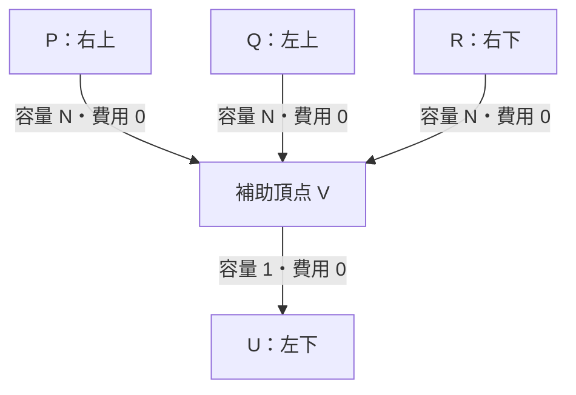

## はじめに

AGC078 に Unrated で参加したが、1 問も解けなかった。そこで A 問題の公式解説を読み、理解するまでの過程をこの記事にまとめる。

対象読者は、公式解説を読んだものの、全体的に行間が埋められず理解しきれなかった人だ。公式解説のポイントを 1 つずつ引用し、その行間を埋める形で進めていく。

## 問題

- https://atcoder.jp/contests/agc078/tasks/agc078_a
- A, B, C を N 個ずつ含む長さ 3N の文字列 S, T が与えられる
- 操作: 文字がすべて異なる部分文字列を選び、昇順に並べ替える
- S を T にする最小操作回数を求める。不可能なら -1（N ≤ 100）

## 操作の考察

公式にある通り、以下の 6 種類。

長さ 2 の操作:
- BA → AB
- CA → AC
- CB → BC

長さ 3 の操作:
- BCA → ABC
- CAB → ABC
- CBA → ABC

::: message
なお、長さ 3 の部分文字列（3 文字がすべて異なるもの）は ABC の並べ替え 6 通りだが、次の 3 つは除いている。

- `ABC` は並べ替えても変わらない
- `BAC → ABC` は `BA → AB` と全く同じ
- `ACB → ABC` は `CB → BC` と全く同じ

残りの 3 つが、長さ 2 の操作では表せない本質的な長さ 3 の操作になる。
:::

## 解法の全体像

答えは「C と A の転倒数の差」と「最小費用流のコスト」の和に分解できる。前半のポイント 1〜2 では、操作回数を、操作の仕方によらない「固定部分」と、操作の仕方で変わる「変動部分」に切り分ける。後半のポイント 3〜5 では、変動部分を、B を駒とした格子上の最小費用流で求める。

## ポイント 1：CA の逆転回数は一定

最初のポイントは、長さ 3 の操作と `CA → AC` の操作回数の総和が常に一定になることだ。

A と C の転倒数を以下のように定義する。

$$
I(X)=\#\{(i,j)\mid i<j,\ X_i=C,\ X_j=A\}
$$

各操作による転倒数 $I$ の変化をみてみる。

| 操作 | C と A の前後関係 | $I$ の変化 |
|---|---|---:|
| `BA → AB` | 変わらない | 0 |
| `CB → BC` | 変わらない | 0 |
| `CA → AC` | 1 組が正しい順になる | −1 |
| `BCA → ABC` | 1 組が正しい順になる | −1 |
| `CAB → ABC` | 1 組が正しい順になる | −1 |
| `CBA → ABC` | 1 組が正しい順になる | −1 |

上 2 つの操作は $I$ を変化させない。
下 4 つの操作は $I$ を減少させる。

ここから 2 つのことがわかる。

まず、$I$ は増やせないので、$I(S) \ge I(T)$ は変換可能であるための必要条件になる。

次に、$N(X)$ を部分文字列 $X$ に対する操作の回数とする（例: $N(CA)$ は CA → AC の回数）。すると次が成り立つ。

$$
N(CA) + N(\text{長さ 3}) = I(S) - I(T)
$$

右辺は $S, T$ だけで決まるので、どんな順序で操作しても左辺の回数は一定になる。

## ポイント 2：操作回数を左右するのは BA と CB だけ

> 言い換えると、この問題は BA → AB と CB → BC がコスト $1$ で、他の操作はコスト $0$ である、とみなすことが出来ます。

ポイント 1 によって、操作回数の総和は次のように表せる。

$$
\begin{aligned}
& \text{操作回数の総和} \\
& = N(BA) + N(CB) + N(CA) + N(\text{長さ 3}) \\
& = N(BA) + N(CB) + I(S) - I(T) \\
\end{aligned}
$$

ここで、ポイント 1 の結果を利用した。

つまり、操作回数は $N(BA)$ と $N(CB)$ によってのみ変動する。
公式解説が `BA → AB` と `CB → BC` をコスト $1$、それ以外をコスト $0$ とみなしているのは、このためだ。固定部分は前もって計算しておき、変動部分だけを最小化する。そのために、固定部分のコスト（操作回数の変動への寄与）を $0$ にしている。この意味は、後の最小費用流のところでより明らかになる。
ここで大事なのは、コストの割り当てではなく、操作回数を変動させるものがなんなのかをはっきり理解すること。

例えば、`CBA` を `ABC` に変換する操作について考えると、

| 手順 | 操作回数 | $N(BA)+N(CB)$ |
|---|---:|---:|
| `CBA → ABC` | $1$ | $0$ |
| `CBA → BCA → BAC → ABC` | $3$ | $1+0+1=2$ |

となっている。$\text{操作回数}-(N(BA)+N(CB)) = 1 = I(CBA) - I(ABC)$ となっていることがわかる。

## ポイント 3：B を格子上の駒とみなす

> そして、各 B について「自分より右側の A の個数」「自分より左側の C の個数」を管理することを考えると、B を二次元格子点上を動く $N$ 個の駒として考えることが出来ます。

B が関わる操作（`BA → AB`、`CB → BC`、長さ 3 の操作）をすると、B の周囲の A の個数、C の個数の少なくとも一方が変化する。それを平面上の動きになぞらえている。なお `CA → AC` では B は動かない（ポイント 5 で扱う）。

ちなみに、B を中心にして、どちらの個数を数えるかは、二次元平面に対応させたときの駒の移動方向に影響を与える。

| 座標 $(x,y)$ の定義 | `BA → AB` | `CB → BC` | `CBA → ABC` |
|---|---|---|---|
| （右の A、左の C） | 左 $(-1,0)$ | 下 $(0,-1)$ | 左下 $(-1,-1)$ |
| （右の A、右の C） | 左 $(-1,0)$ | 上 $(0,+1)$ | 左上 $(-1,+1)$ |
| （左の A、左の C） | 右 $(+1,0)$ | 下 $(0,-1)$ | 右下 $(+1,-1)$ |
| （左の A、右の C） | 右 $(+1,0)$ | 上 $(0,+1)$ | 右上 $(+1,+1)$ |

以降の説明と実装では、1 行目（右の A、左の C）の定義を使う。

## ポイント 4：駒を区別しなくてよい理由

> これを踏まえると、この問題は $2$ 次元平面上の多品種フローのような問題と考えることが出来ます。

多品種フローと考えるということは駒を区別するということ。 駒をなぜ区別するのか？
$S$ 上の B を左から順番に $B_1, B_2, \dots, B_{N}$ とする。
$T$ 上の B を左から順番に $B'_1, B'_2, \dots, B'_{N}$ とする。
この時、$B_1, B_2, \dots, B_N$ と $B'_1, B'_2, \dots, B'_N$ はそれぞれ順番を維持しなければならず、$B_i$ と $B'_i$ は最終的に両者が対応した位置にいなければならない。 なぜなら、問題の制約として、「異なる文字だけで構成された部分文字列に操作をする」ことになっているから。 同じ文字に操作ができないなら順番は入れ替えようがないので順番は維持されなければならない。 順番は維持されなければならないため、B に対応した駒は区別されなければならない。

ただ、

> グラフが平面的なので、フローのパス同士が交差したら交換可能なことに注目すると、結局すべての条件を多品種ではないフロー、つまり最小費用流として書き下すことが出来ます。

とあるように、最小費用流を計算するグラフ上の動きとして見ると、駒は入れ替え可能とみなせる。

例えば、$B_1$ の出発点を $s_1$、到着点を $t_1$、$B_2$ についても同様に $s_2,t_2$ とする。2 本が頂点 $v$ を共有しているとする。
この時、

| | $B_1$ の経路 | $B_2$ の経路 |
|---|---|---|
| 交換前 | $s_1\to v\to t_1$ | $s_2\to v\to t_2$ |
| 交換後 | $s_1\to v\to t_2$ | $s_2\to v\to t_1$ |

となり、全体で使っている辺と、その使用回数は変わらない。そのため、最小費用流の計算結果に影響を与えない。

そして、担当が入れ替わった 2 本の経路は、必ずどこかの頂点で交わる。グラフが平面的、つまり立体交差がないからだ。したがって、上の入れ替えはいつでも行える。

::: message
参考に、次の問題がこの交換可能性と似た問題である。

https://atcoder.jp/contests/tessoku-book/tasks/tessoku_book_aq
:::

## ポイント 5：CA ペアで無料移動できる

> 基本的に各 B はコスト $1$ で距離 $1$ を移動しなければならないのですが、各格子点(= CA ペア)ごとに、高々 $1$ つまで B の移動を巻き込むことができます。

まず、格子点と CA ペアを対応づける。A に右から $A_1, A_2, \dots, A_N$、C に左から $C_1, C_2, \dots, C_N$ と番号を付ける（S と T で同じ付け方をする）。すると、ポイント 3 の座標で $(x, y)$ にいる B にとって、右側で最も近い A は $A_x$、左側で最も近い C は $C_y$ になる。こうして、格子点 $(x, y)$ に CA ペア $(C_y, A_x)$ を対応づけられる。

この格子点 $(x, y)$ については、

1. S 上において $C_y$ と $A_x$ がこの順に並んでいる
1. T 上において $A_x$ と $C_y$ がこの順に並んでいる

のどちらも満たす時に限り、このペアを長さ 3 の操作（3 種のいずれか）で逆転させる余地があり、その時 B は $(x-1, y-1)$ に移動できる。
この場合に限るのは、長さ 3 の操作が必ず C と A を入れ替える操作だからだ。

例えば $N=2$、$S=$ `CBACBA`、$T=$ `ABCABC` のとき、各ペアは次のようになる。

| マスの右上 $(x,y)$ | ペア | S での順番 | T での順番 | 無料移動を置く？ |
|---|---|---|---|---|
| $(1,1)$ | $C_1,A_1$ | C → A | C → A | 置かない |
| $(2,1)$ | $C_1,A_2$ | C → A | A → C | **置く** |
| $(1,2)$ | $C_2,A_1$ | C → A | A → C | **置く** |
| $(2,2)$ | $C_2,A_2$ | A → C | A → C | 置かない |

::: message
ここで重要な点として、次の 2 条件を考える。

1. S 上において $A_x$ と $C_y$ がこの順に並んでいる
1. T 上において $C_y$ と $A_x$ がこの順に並んでいる

の 2 条件を満たすペアが 1 つでもあれば、$S$ を $T$ に変換できない（答えは $-1$）。一度 A→C の順になったペアは、どの操作でも C→A に戻せないからだ。これは、ポイント 1 の必要条件をペア単位で考えたものだ。
:::

$(x, y)$ にいる B が `CBA → ABC` をするとき、B をまたいで入れ替わる C と A は、ちょうど $C_y$ と $A_x$ だ。

S で C→A、T で A→C のペアは、どこかで必ず 1 回だけ逆転する。逆転のさせ方は 2 通りある。1 つは `CA → AC` による逆転で、このとき B は動かない。もう 1 つは長さ 3 の操作による逆転で、B を 1 個巻き込み、その B はコスト $0$ で移動できる（ポイント 2）。どちらを選んでも固定部分（ポイント 1）の回数は同じなので、巻き込めるなら巻き込んだほうが得になる。ただし逆転は 1 回きりで、一度 A→C になると戻せない。そのため、巻き込める B も高々 1 個になる。これが「高々 $1$ つまで巻き込める」の意味だ。

また、この移動においては、冒頭で述べたように、以下の 3 つの長さ 3 の操作に対応した移動のいずれか一つしか実行できない。

| 頂点 | 座標 |
|---|---|
| P：右上 | $(x,y)$ |
| Q：左上 | $(x-1,y)$ |
| R：右下 | $(x,y-1)$ |
| U：左下 | $(x-1,y-1)$ |

| 操作 | 無料移動 |
|---|---|
| `CBA → ABC` | P → U（左下） |
| `CAB → ABC` | Q → U（下） |
| `BCA → ABC` | R → U（左） |

そのため、以下のような補助頂点 $V$ の導入が必要となる。



補助頂点を入れても、ポイント 4 の「立体交差がない」は崩れない。

V をマスの中央に置き、P, Q, R, U とはマスの内側を通る辺で結ぶ。格子の辺はマスの外周を通るので、こう描けばどの辺も頂点以外では交差しない。さらに、V から出る辺は V → U の 1 本だけで、容量は 1 だ。そのため V を通る駒は高々 1 個で、V で 2 本の経路が出会うことはない。経路同士が交わるのは格子点だけになる。

## 実装例 (Python)

以上をまとめると、グラフは次のように構成できる。

| 役割 | 辺 | 容量 / コスト |
|---|---|---|
| スタート | source → S の B | $1$ / $0$ |
| ゴール | T の B → sink | $1$ / $0$ |
| 通常移動 | 左・下へ 1 マス | $N$ / $1$ |
| 無料移動の入口 | P, Q, R → V | $N$ / $0$ |
| 無料移動の出口 | V → U | $1$ / $0$ |

答えは、最小費用流のコストに転倒数の差 $I(S) - I(T)$ を足したものになる。転倒数の差は、S で C→A（S で転倒）かつ T で A→C（T で転倒していない）のペアの数に等しい（-1 のケースを除く）。コードの `fixed_cost` はこれを数えている。

-1 になるのは次の 2 つの場合だ。

- S で A→C、T で C→A のペアがある（ポイント 5 の message）
- 流量が $N$ に届かない（駒をすべてゴールへ運べない）

以上から以下のような実装ができた。

<https://atcoder.jp/contests/agc078/submissions/79594180>

```python
from atcoder.mincostflow import MCFGraph

N = int(input())
S = input()
T = input()


W = N + 1
M = 2 * W * W


def node(i: int, j: int):
    return i * W + j


def support(u: int):
    return u + W * W


def get_index_of_abc(s: str) -> tuple[list[int], list[int], list[int]]:
    # 右から i 番目の A の s 上での位置
    a_on_s: list[int] = []
    # 左から i 番目の C の s 上での位置
    c_on_s: list[int] = []
    # s 上の B の位置 (B は index はいらない)
    b_on_s: list[int] = []

    for i in range(3 * N):
        if s[i] == "A":
            a_on_s.append(i)
        elif s[i] == "C":
            c_on_s.append(i)
        else:
            # na: この B より右にある A の数
            na = N - len(a_on_s)
            # nc: この B より左にある C の数
            nc = len(c_on_s)
            # B を (na, nc) に置く。グラフの頂点番号としては na*W + nc として扱う
            b_on_s.append(node(na, nc))

    a_on_s.reverse()  # 右から i 番目の A の位置を求めるために reverse する

    return a_on_s, b_on_s, c_on_s


a_on_s, b_on_s, c_on_s = get_index_of_abc(S)
a_on_t, b_on_t, c_on_t = get_index_of_abc(T)


source = M
sink = M + 1
g = MCFGraph(M + 2)

for x in range(W):
    for y in range(W):
        u = node(x, y)
        if x > 0:
            g.add_edge(u, node(x - 1, y), N, 1)
        if y > 0:
            g.add_edge(u, node(x, y - 1), N, 1)

fixed_cost = 0  # 転倒数の差 I(S) - I(T)
for x in range(1, W):
    for y in range(1, W):
        if a_on_s[x - 1] < c_on_s[y - 1] and c_on_t[y - 1] < a_on_t[x - 1]:
            # AC を CA にすることはできない。
            print(-1)
            exit()

        if c_on_s[y - 1] < a_on_s[x - 1] and a_on_t[x - 1] < c_on_t[y - 1]:
            fixed_cost += 1

            # CA を AC にする場合は、追加で辺を張る
            p = node(x, y)  # 左下に向かって u に入る
            q = node(x - 1, y)  # 下に向かって u に入る
            r = node(x, y - 1)  # 左に向かって u に入る
            u = node(x - 1, y - 1)
            v = support(u)

            g.add_edge(p, v, N, 0)
            g.add_edge(q, v, N, 0)
            g.add_edge(r, v, N, 0)
            g.add_edge(v, u, 1, 0)


# S 上の B の位置に source から容量 1 / コスト 0 の辺を張る。
for b in b_on_s:
    g.add_edge(source, b, 1, 0)

# T 上の B の位置に sink への容量 1 / コスト 0 の辺を張る。
for b in b_on_t:
    g.add_edge(b, sink, 1, 0)

flow, cost = g.flow(source, sink)
if flow < N:
    print(-1)
else:
    print(cost + fixed_cost)
```

## まとめ

- 操作回数 =（固定部分）$I(S) - I(T)$ +（変動部分）$N(BA) + N(CB)$ に分解できる
- 変動部分は、B を「右の A の数、左の C の数」の格子上の駒とみなし、1 マス動くとコスト 1 の移動として表せる
- 長さ 3 の操作と CA → AC は、CA ペアごとに高々 1 回の無料移動になり、補助頂点と容量 1 の辺で表せる
- 駒は区別が必要に見えるが、経路を入れ替えても費用は変わらないので、ただの最小費用流で解ける

理解の鍵は、操作回数を「固定部分」と「変動部分」に分ける発想だった。これが見えると、残りは変動部分だけを最小化する問題として、素直に最小費用流へ落とし込める。
